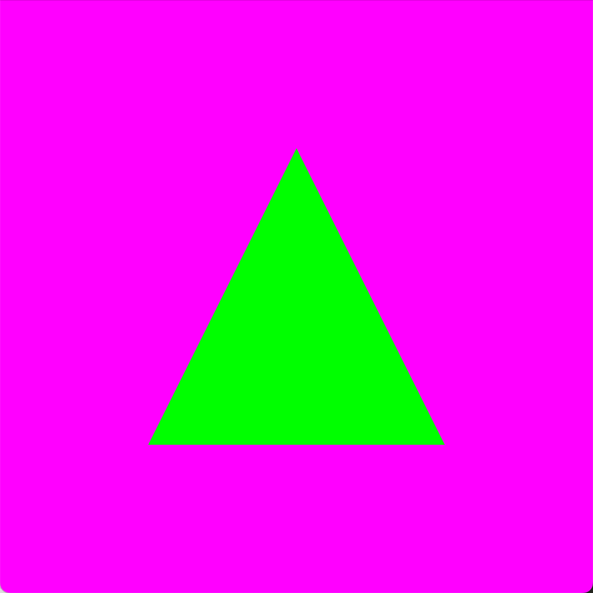

# Hello OpenGL

This repository has a program that mirrors the layout and functionality of CSPC 486 programming projects. If you can compile and run this program, then there is a reasonably high likelihood that your development environment is set up for graphics programming.

The program shall display a window with a purple background and a green isosceles triangle. The window shall be 600 x 600 pixels large. A screenshot is shown below.

[](images/screenshot.png)


## Linux Requirements

This project has been tested on Ubuntu 24 LTS. Please see the course's Canvas page module named Development Environment for details on how to configure your development environment. If you have already set up your Linux environment using the [quickinstall.sh](https://github.com/mshafae/tusk/blob/main/quickinstall.sh) script, then you may need to install additional software packages: libglfw3-dev and python3-glad.

```bash
sudo apt install libglfw3-dev python3-glad
```

## Makefile

The Makefile has the following targets:

* all: builds the project
* clean: removes object and dependency files
* spotless: removes everything the clean target removes and all binaries
* format: outputs a [`diff`](https://en.wikipedia.org/wiki/Diff) showing where your formatting differes from the [Google C++ style guide](https://google.github.io/styleguide/cppguide.html)
* lint: output of the [linter](https://en.wikipedia.org/wiki/Lint_(software)) to give you tips on how to improve your code
* authors: check to make sure your files have the appropriate AUTHORS.md file
* unittest: run unit tests to help you verify that the units (such as functions) are meeting the assignment's requirements. This does not grade your assignment.
* test: run tests to help you verify your program is meeting the assignment's requirements. This does not grade your assignment.

To build the program use the `make` command. The Makefile's default target is to build `all`.
